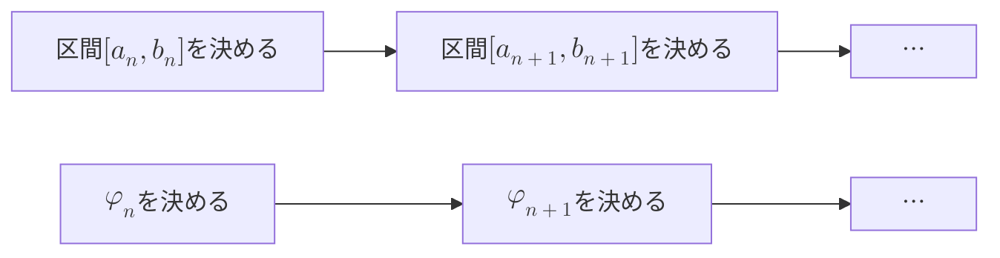

このページは書きかけのページです．

# {{ page.title }}

Bolzano-Weierstrassの定理は，以下のような定理です．

::: warning Bolzano-Weierstrassの定理
任意の有界な実数列は，収束する部分列を持つ．
:::

この定理に対して，有名な数学書では次のような証明が与えられています．

ここに証明を記入

しかし，上記の証明には，いくつかの疑問点がのこり，そのことによって，以下のような誤解が生じることがあります．

- Bolzano-Weierstrassの定理の証明には，選択公理を使う．
- Bolzano-Weierstrassの定理の証明は非構成的で，不完全である．

また，これらの誤解により数学を学ぶ人が，数学の基礎を学ぶことに対して，興味を失ってしまったり，解析学についていけなくなってしまったりします．

そこで，このページではBolzano-Weierstrassの定理の証明をできるだけフォーマルに行い，その疑問点を解消することを目的とします．

## 証明

以下のように，\(\alpha _{n}, a, b\) を定義します．

- \(\alpha _{n}\): 有界な実数列
- \(a\): \(\alpha _{n}\) の下限
- \(b\): \(\alpha _{n}\) の上限

## 無限に点が存在する区間を選べるか問題

自然数の部分集合 \(A\) に対して，「\(A\) が無限集合である」ということを意味する論理式を \(\Phi(A)\) と定義します．

\begin{align*}
\Phi(A) & \equiv \text{\(A\)が有限集合} \\
& \Leftrightarrow \exists n \in \mathbb{N} \exists f : \{0, \dotsc, n \to A\} \text{: 全単射} \\
\end{align*}

無限の概念を，自然数論の範囲内で記述することで，実数論の無限概念に言及せずに証明を行うことができます．

自然数の部分集合の内，有限集合の全体を \(\mathcal{A}\) と定義します．

\begin{align*}
\mathcal{A} := \{ A \in 2 ^\mathbb{N} \mid \Phi(A) \} \\
\end{align*}

\(\mathcal{A}\)の特性関数 \(\chi _{\mathcal{A}}\) を使って，「点が無限に存在する」という記述を判定していきます．
特性関数の存在については，別のページで述べます．

次に，数列 \(a _{n}, b _{n}, \varphi _{n}\) を帰納的に定義します．

- \(a _{0} = a\)
- \(b _{b} = b\)
- \(\varphi _{0} = 0\)
- \(C _{n} = \{ k \in \mathbb{N} \mid \alpha \in [a _{n}, \dfrac{a _n + b _n}{2}]\}\): \([a _{n}, b _{n}]\) の左側に入っている \(\alpha _{k}\) の添え字の集合

\(a _{n}, b _{n}, \varphi _{n}\) が定まっているとして，\(a _{n+1}, b _{n+1}, \varphi _{n+1}\) を次のように定義します．

\begin{align*}
a _{n+1} & = \chi _{\mathcal{A}}(C _{n}) \dfrac{a _n + b _n}{2} + (1-\chi _{\mathcal{A}}(C _{n})) a _{n}
\end{align*}

これは，\(a _{n}\) から \(a _{n+1}\) を定義する際に，
- \(C _{n}\) が有限集合であれば，現在の区間の中点を次の区間の左端点にする
- \(C _{n}\) が無限集合であれば，現在の区間の左端点をそのまま次の区間の左端点にする
という判定を行っていることになります．

同様に，\(b _{n+1}\) も定義します．
\begin{align*}
b _{n+1} & = \chi _{\mathcal{A}}(C _{n}) b _{n} + (1-\chi _{\mathcal{A}}(C _{n})) \dfrac{a _n + b _n}{2}
\end{align*}

## 区間の決めた方と部分列の取り方に関するイメージの問題

つぎに\(\varphi _{n+1}\) を定義します．

\begin{align*}
  \varphi _{n+1} & = \inf \{ k  \in \mathbb{N} \mid \alpha _{k} \in [a _{n}, b _{n}]\} \backslash \{0, 1, \dotsc, \varphi _{n}\}
\end{align*}

これは，現在定まっている区間 \([a _{n}, b _{n}]\) に入っている \(\alpha _{k}\) の点列のうち，既に定まっている点以降の最も若い添え字を選ぶことを意味します．

実は，区間を半分に分けて行く作業と，その半分の区間から点列を選んで行く作業は，別々に行われています．というよりは，先に区間を分けていく作業を行い，後から点を選び出します．

つまり，

ではなく，

という作業になります．

\(\{ k  \in \mathbb{N} \mid \alpha _{k} \in [a _{n}, b _{n}]\}\) は自然数の部分集合ですから，空集合でなければ，最小値が存在します．

そこで，
\begin{align*}
  D _{n} := \{ k  \in \mathbb{N} \mid \alpha _{k} \in [a _{n}, b _{n}]\}
\end{align*}
とおいて，全ての自然数 \(n\) に対して \(D _{n}\) が空集合でないことを示します．

\(n=0\) のとき，
\begin{align*}
  D _{0} & = \{ k  \in \mathbb{N} \mid \alpha _{k} \in [a _{0}, b _{0}]\} \\
          & = \{ k  \in \mathbb{N} \mid \alpha _{k} \in [a, b]\} \\
          & = \mathbb{N}
\end{align*}
ですから，これは空集合ではありません．

つぎに，ある \(n\) に対して \(D _{n}\) が空集合でないと仮定します．これはつまり，\([a _{n}, b _{n}]\)に入っている点が無限に存在することを意味します．
ここから，\([a _{n+1}, b _{n+1}]\) が \(\alpha _{k}\) の点列を無限に含むことが言えればOKです．

## 真偽で場合分けをして推論することの問題

論理式
\begin{align*}
  \chi _{\mathcal{A}}(C _{n}) = 0 \lor \chi _{\mathcal{A}}(C _{n}) \neq 0
\end{align*}
は常に演繹できます．

ここは，真偽概念と証明可能性という概念が入り組む，重要なポイントです．

\(\chi _{\mathcal{A}}(C _{n}) = 0\) すなわち\(C _{n}\) が無限集合のとき，
\(a _{n+1} = a _{n}, b _{n+1} = \frac{a _{n} + b _{n}}{2}\)なので
\begin{align*}
  D _{n+1} &= \{ k  \in \mathbb{N} \mid \alpha _{k} \in [a _{n+1}, b _{n+1}]\} \\
          &= \{ k  \in \mathbb{N} \mid \alpha _{k} \in [a _{n}, \frac{a _{n} + b _{n}}{2}]\} \\
           &= C _{n}
\end{align*}
となり，\(D _{n+1}\)は無限集合です．

一方で，\(\chi _{\mathcal{A}}(C _{n}) \neq 0\) すなわち\(\chi _{\mathcal{A}}(C _{n}) = 1\)なら \(a _{n+1} = \frac{a _{n} + b _{n}}{2}, b _{n+1} = b _{n}\)ですから，
\begin{align*}
  D _{n+1} &= \{ k  \in \mathbb{N} \mid \alpha _{k} \in [a _{n+1}, b _{n+1}]\} \\
          &= \{ k  \in \mathbb{N} \mid \alpha _{k} \in [\frac{a _{n} + b _{n}}{2}, b _{n}]\} \\
           &= D _{n} \backslash C _{n} \cup \{k \in \mathbb{N} \mid \alpha _{k} = \dfrac{a _{n} + b _{n}}{2}\}
\end{align*}
となります．帰納法の仮定より，\(D _{n}\) が無限集合，\(C _{n}\)は有限集合なので，\(D _{n}\) は無限集合です．

以上で，全ての \(D _{n}\) に対して \(D _{n}\) が無限集合であることが言えたので，
\begin{align*}
  \varphi _{n+1} & = \inf \{ k  \in \mathbb{N} \mid \alpha _{k} \in [a _{n}, b _{n}]\} \backslash \{0, 1, \dotsc, \varphi _{n}\}
\end{align*}

全ての \(n\)に対して定義されていることがわかりました．

後は，\(\alpha _{\varphi _{n}}\)が収束することを示せば良いです．

## 区間が縮小しても収束するとは限らない問題

どのような公理を用いて\(\alpha _{\varphi _{n}}\)が収束することを示すかがキモですが，次の公理を用いるのが最も簡潔です．
::: warning 単調有界列の収束
上に有界な単調非減少列は収束する．
:::

上記で構成した\(a _{n}\) は
\begin{align*}
  a _{0} \leq a _{1} \leq \dotsc \leq b
\end{align*}

を満たすので上に有界な単調非減少列です．したがって収束します．\(a _{n}\)の収束先を\(a _{\infty}\)とおきます．同様に，\(b _{n}\)も収束するので，\(b _{n}\)の収束先を\(b _{\infty}\)とおきます．\(\alpha _{\varphi _{n}}\)は\(\frac{a _{\infty} + b _{\infty}}{2}\)に収束するのです．

\begin{align*}
  a _{n} \leq \alpha _{\varphi _{n}} \leq b _{n}
\end{align*}
より，
\begin{eqnarray}
  & \left|\alpha _{\varphi _{n}} - \frac{a _{\infty} + b _{\infty}}{2}\right|\\
  \leq & \frac{1}{2} \left\{ \left|\alpha _{\varphi _{n}} - a _{\infty}\right| + \left|\alpha _{\varphi _{n}} - b _{\infty}\right| \right\}\\
  \leq & \frac{1}{2} \left\{ \left|\alpha _{\varphi _{n}} - a _{n}\right| + \left|a _{n} - a _{\infty}\right| + \left|\alpha _{\varphi _{n}} - b _{n}\right| + \left|b _{n} - b _{\infty}\right| \right\} \\
  \leq & \frac{1}{2} \left\{ \left| b _{n} - a _{n}\right| + \left|a _{n} - a _{\infty}\right| + \left| a _{n} - b _{n}\right| + \left|b _{n} - b _{\infty}\right| \right\} \\
  \leq & \frac{1}{2} \left\{ \frac{1}{2 ^{n}}\left| b  - a\right| + \left|a _{n} - a _{\infty}\right| + \frac{1}{2 ^{n}}\left| b  - a\right| + \left|b _{n} - b _{\infty}\right| \right\} \\
  \to & 0
\end{eqnarray}